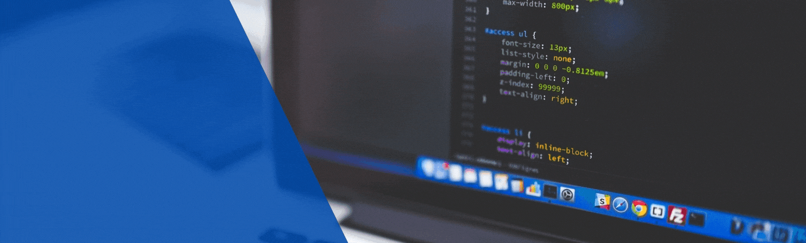

<!-- ********************************* Logotipo ************************************************ -->
   

<!-- ****************************************** Bio ******************************************** -->

Hi, I'm Bruno Eduardo, a passionate self-taught developer from Campinas-SP.

- 🔭 Hi I’m currently working at [Indra](https://www.indracompany.com/pt-br/indra) developing on Delphi and Oracle eventually on Java Android and in my free time i'm working on my Ecommerce Platform, using NodeJs and ReactJs.
- 🌱 I’m currently learning **NodeJs**, **JavaScript**, **TypeScript**, **ReactJs**, **React Native**, **Java**, **Spring** and **Kotlin** 
- ⚙️ Mastering: `.pas`,`.sql`,`.html`,`.css`
- 💬 I'm mostly active within the **HTML**, **CSS**, **JavaScript**, **NodeJs** and **Delphi** communities

### 📬 Get in Touch

- StackOverflow: [stackoverflow.com/federico-dondi][stackoverflow]
- GitHub: [github.com/federico-dondi][github]
- LinkedIn: coming soon
- Site: [federico-dondi.github.io][site]
- E-mail: federico.dondi2@studio.unibo.it

<!-- ********************************* Social Media ******************************************** -->

  <h4><strong>Follow me on Social Media</strong></h4>

   &ensp;&ensp;
   &ensp;&ensp;
   &ensp;&ensp;
   &ensp;&ensp;
  

<!-- ********************************* My Stack ******************************************** -->

   <h4><strong>My Stack</strong></h4>
   &ensp;&ensp;
   &ensp;&ensp;
    &ensp;&ensp;
   &ensp;&ensp;
   &ensp;&ensp;

<!-- ********************************* Tools ******************************************** -->

   <h4><strong>Tools</strong></h4>
   &ensp;&ensp;
   &ensp;&ensp;
   &ensp;&ensp;
   &ensp;&ensp;
   &ensp;&ensp;
   &ensp;&ensp;
   &ensp;&ensp;
   &ensp;&ensp;
   &ensp;&ensp;
   &ensp;&ensp;
   &ensp;&ensp;
   &ensp;&ensp;
   &ensp;&ensp;

<!-- ********************************* Always Learning **************************************** -->
**Always Learning**

 &ensp;&ensp;
 &ensp;&ensp;
 &ensp;&ensp;
 &ensp;&ensp;
 &ensp;&ensp;
 &ensp;&ensp;
 

&nbsp;

**Statistics:**

_NOTE: Top languages does not indicate my skill level or something like that, it's a github metric of which languages i have the most code on github, it's a new feature of [github-readme-stats](https://github.com/anuraghazra/github-readme-stats)_

    <tr>
      <td>

      </td>
    </tr>
      <td>

      </td>
    <tr>
      <td>

      </td>
    </tr>
    <tr>
      <td>

      </td>
    </tr>

---
